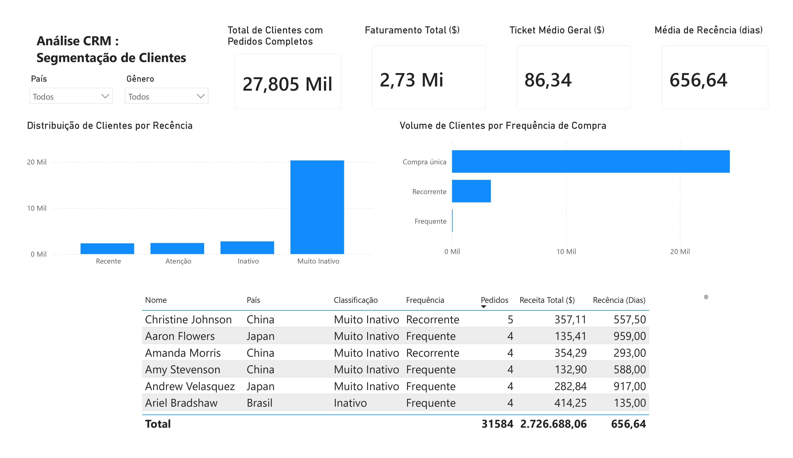

# Análise CRM - TheLook E-Commerce

## Desafio de Negócio
Descrição do problema: transição de uma visão transacional para uma estratégia de CRM focada em retenção, ciclo de vida do cliente e reativação.

## Stacks
* **Banco de Dados/Data Warehouse:** Google Cloud BigQuery (SQL)
* **Visualização de Dados:** Power BI
* **Conceitos de CRM:** Matriz RFM (Recência, Frequência e Valor)

## Modelagem e Lógica SQL
* **Etapas:**

* Exploração e Saneamento dos Dados (SQL no BigQuery)

Foi definido como fonte única para métricas financeiras e para a data de referência temporal pedidos completos.

Cálculo de Métricas por Cliente: Criação de CTEs para calcular a recência, frequência,receita total e ticket médio por cliente.

* Construção e Diagnóstico da Matriz RFM

Regras de Segmentação:
Recência: Recente 0–30 dias, Atenção 31–90 dias, Inativo 91–180 dias e Muito Inativo 181+ dias.

Frequência: Compra única 1 pedido, Recorrente 2–3 pedidos e Frequente 4+ pedidos.

Diagnóstico de Negócio:
Cruzamento dos eixos para quantificar o tamanho de cada segmento e avaliar a saúde da base.

* Integração e Modelagem Analítica

Criação de uma tabela analítica por cliente, enriquecida com dados demográficos da tabela users (nome, país, gênero, idade).

Conexão direta da consulta SQL no Power BI Desktop, mantendo o processamento de dados na nuvem (BigQuery).

## Insights 
* Alto volume de clientes na categoria Muito Inativo e Compra única, mais de 18 mil clientes.
* Por volta de 2.500 clientes recorrentes inativos com mais de R$ 440 mil em receita histórica.
* **Sugestão**: Estratégia de reativação focada em clientes recorrentes inativos.

## 🖥️ Dashboard Interativo

